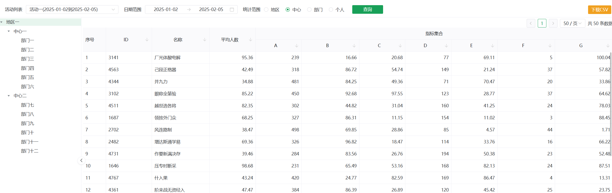

 ## Introduction
[README in Chinese](README.md)

On most data platforms online, various plugins are displayed, but the common functions of data statistics systems in actual work are not shown. This system, based on relevant experience in actual work, presents the commonly used functions of data systems to everyone. It is purely a personal and amateur sharing.

 ## Technology
 vue + axios + naiveui + mock + vue-router + vite
 
 ## Development

 ```bash
git clone https://github.com/yu10012015/data_web.git

cd data_web

npm install  

npm run dev

 ```
## Explain
- If it helps you, you can click "Star" in the upper right corner to support,thank you. ^_^
- May be you can "follow" me, I will make more interstng projects.
- This project is merely a demo demonstration. The background data is provided using mock+vite-plugin-mock
- vue-router It's just to lay the groundwork for further development in the future

## Features
1. n-layout layout and support side box folding
2. Tree plugin loading Department structure - Completed
3. The linkage between the drop-down box and n-date-picker - completed
4. radiogroup implementation level screening - Completed
5. Download the data csv - Done
6. n-table data loading - Completed
7. Implementation of n-table Double Headers - Completed
8. n-table columns support sorting -- completed
9. Data execution page turning and data page changes - Completed
10. Use mock+vite-plugin-mock to provide the data used in the project - completed

## Screenshot


